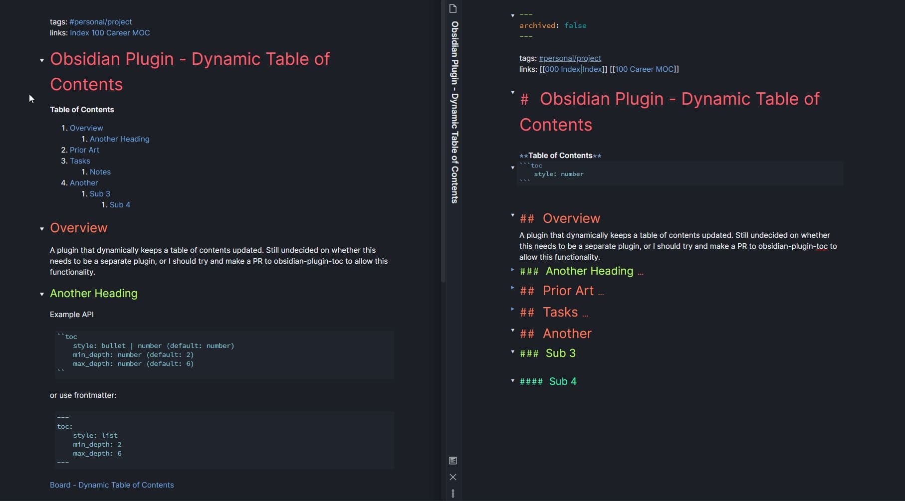
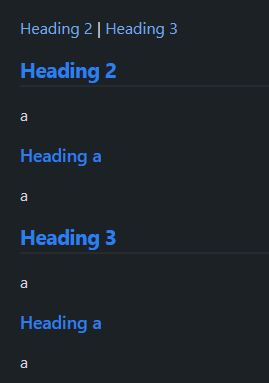
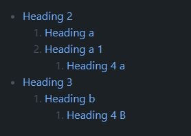
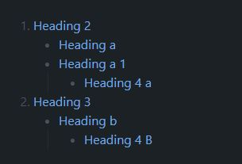
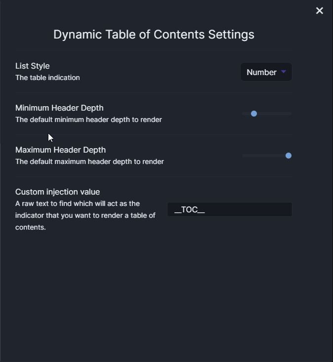
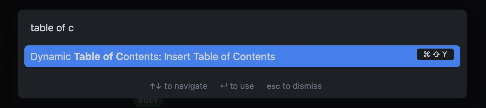
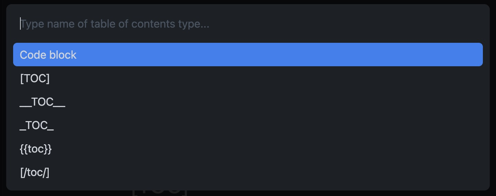

# ⚠️ Notice
I'm unable to find the time to keep this repository well maintained, and up-to-date with Obsidian. Life gets in the way. This plugin should be forked/rebuilt by someone who is willing to find the time to build a plugin that the Obsidian community deserves. 


# Obsidian Dynamic ToC

An Obsidian plugin to generate Tables of Contents that stay up to date with your document outline. Heavily inspired from [hipstersmoothie/obsidian-plugin-toc](https://github.com/hipstersmoothie/obsidian-plugin-toc)



## Foreword

This plugin attempts to parse your document headings and generate a markdown table of contents for them. There have been a handful of issues raised which are due to how people are using headings. Headings offer a lexical structure to a document, they are not intended to be used for style.

The following is an example of inconsistent heading depth. Instead of a level 4 heading it should be a level 3 heading.

```md
## Level 2

#### Level 4
```

The following is an example of consistent heading depth. After a level 2 heading the next level is 3

```md
## Level 2

### Level 3
```

👉 You can of course choose to structure your documents **as you wish**, but this plugin may not work effectively. I do attempt to make some exceptions but I will hide them behind settings to not interfere with peoples work flows, reduce stability, and to keep development time low. See [Inconsistent Heading Depth](#inconsistent-heading-depth)

## Usage

### Code Block

It's really simple to use, just add a code block to your document:

> 👉YAML does not support tabs, only use spaces ([source](http://yaml.org/faq.html))

**Defaults**

````markdown
```toc
style: bullet | number | inline (default: bullet)
min_depth: number (default: 2)
max_depth: number (default: 6)
title: string (default: undefined)
allow_inconsistent_headings: boolean (default: false)
delimiter: string (default: |)
varied_style: boolean (default: false)
```
````

**Example**

````markdown
```toc
style: number
min_depth: 1
max_depth: 6
```
````

You can specify the options on a case-by-case basis in your documents, or you can override the defaults in settings. If you have settings you always want to use, your usage just becomes:

````markdown
```toc

```
````

### Inline Style

Inline styles render the highest level of heading such as H2 `## Heading 2`, you can couple this with the delimiter option to generate a breadcrumbs like effect for your headings.



See [Feature Request: Inline Links](https://github.com/Aidurber/obsidian-plugin-dynamic-toc/issues/42)

### Varied Style

Varied style allows for setting the topmost level of your headings, and the rest of the levels to the opposite style.

For example if you have `varied_style` set to true and your list style is bullet, the first level will be bullet and the subsequent headings will be number style.

**Style: Bullet**



**Style: Number**



See [Feature Request: Mixed List Style](https://github.com/Aidurber/obsidian-plugin-dynamic-toc/issues/35)

### External Rendering Support



You can also add custom injection for compatibility with markdown readers such as Markor or Gitlab with the External Rendering Support setting. Such as:

- `[toc]`/`[TOC]`
- Or `[[_TOC_]]`

This feature is to allow for consistency with another tool of your choice such as GitLab.

If you have another convention that is required for a markdown reader of your choosing. Create an issue with the name of the viewer and the convention that's used.

#### Support All

You can skip individual selection and support all renderers by checking "Support all external renderers" in settings.

> ! If you add a new line between each identifier, you will get a new table of contents for each

```markdown
[/toc/]

{{toc}}

[[__TOC__]]

[toc]
```

> ! If you add them all next to each other you will get a single block

```markdown
[/toc/]
{{toc}}
[[__TOC__]]
[toc]
```

### Insert Command

You can insert a table of contents by using the command palette and selecting "Insert table of contents" and selecting the table of contents to insert



> Insert command



> Table of contents options.
> Note that you will only see:
>
> 1. "Code Block" if you have no external renderers set in settings
> 2. "Code Block" and a single external renderer if set in settings
> 3. All possible options if you have "Support all external renderers" set in settings

Remember you can set a hotkey in Obsidian for this command for even faster access.

### Titles

You can add a title to every injected table of contents by using the Title option in setttings or inline inside a codeblock for example:

````markdown
```toc
title: "## Table of Contents"
```
````

> ⚠️ If you are adding Markdown syntax to your title in the code block, you must wrap it in double quotes.

### Inconsistent Heading Depth

As mentioned in the foreword above, this is not recommended, but there is a setting you can enable which will try and support you the best it can.

Given a heading structure such as:

```md
## Level 2

#### Level 4

##### Level 5

## Level 2

### Level 3
```

With this option enabled, it will produce the following table of contents:


> ⚠️ Notice that the Level 4 and Level 3 headings are at the same depth

## Contributing

```bash
yarn install
```

### Development

To start building the plugin with what mode enabled run the following command:

```bash
yarn dev
```

### Releasing

To start a release build run the following command:

```bash
yarn release
git push --follow-tags origin main
```

---
