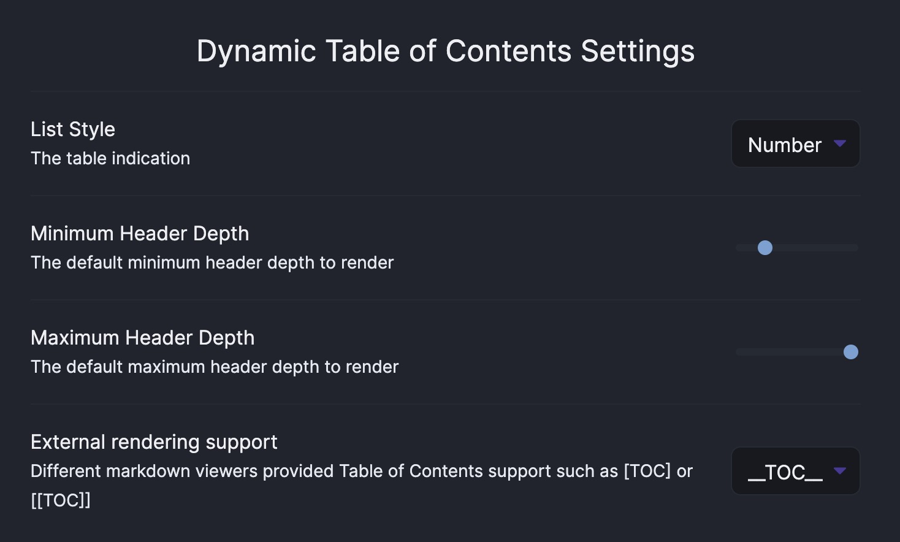

> ⚠ This has not yet been officially released. I'm working as much as I can to get this stable and live! ⚠


# Obsidian Dynamic ToC

An Obsidian plugin to generate Tables of Contents that stay up to date with your document outline. Heavily inspired from [hipstersmoothie/obsidian-plugin-toc](https://github.com/hipstersmoothie/obsidian-plugin-toc)


## Usage

### Code Block

It's really simple to use, just add a code block to your document:

**Defaults**

````markdown
```toc
	style: bullet | number (default: bullet)
	min_depth: number (default: 2)
	max_depth: number (default: 6)
```
````

**Example**

````markdown
```toc
	style: number
	min_depth: 1
	max_depth: 6
```
````

You can specify the options on a case-by-case basis in your documents, or you can override the defaults in settings. If you have settings you always want to use, your usage just becomes:

````markdown
```toc

```
````

### Injection

A more advanced feature you can use is custom injection. You can find an element by text to act as a render target. It's important to note that it matches against the rendered preview of your markdown. So `__TOC__` will match the following markdown `[__TOC__]` or `[[__TOC__]]` but will not match `__TOC__` because `__TOC__` once rendered will be a bold "TOC".

Provide a Custom injection value such as:
`__TOC__` will match `[[__TOC__]]` in your document
`[toc]` will match `[toc]` in your document.

Play around with it, try not to go too wild with it. This feature is to allow for consistency with another tool of your choice such as GitLab.



## Contributing

```bash
yarn install
```

### Development

To start building the plugin with what mode enabled run the following command:

```bash
yarn dev
```

### Releasing

To start a release build run the following command:

```bash
yarn release
git push --follow-tags origin main
```

---
